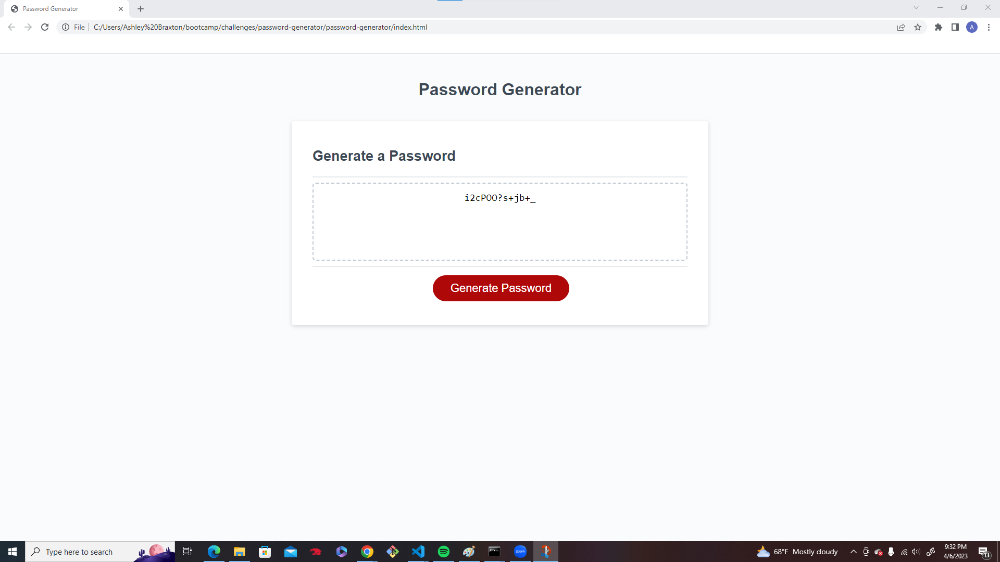

# password-generator
## Description
This is a random password generator that allows a user to input how many characters they would like in their password, and what types of characters they would like such as: lowercase letters, uppercase letters, numbers, and/or special characters. Using user input it creates a password meeting those requirements.

## Installation
N/A
## Usage
User will load page and then click the 'generate password' button and then follow the prompts that will then pop up on the page. user will choose how many characters they woul like in password and what types of characters they would like included in the password as well. Once the user completes the prompts the password will be generated and displayed in password box.

## License

MIT